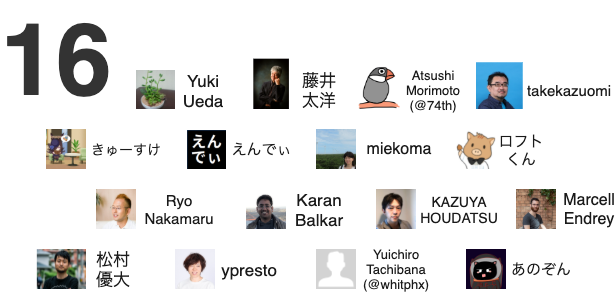

  

---

### エンディング

* 数字で見る今年のカンファレンス
* 今後の予定＆予告
* 最後に

---
### 数字で見る今年のカンファレンス(昨年を上回る申し込み)

  

  

---
### 数字で見る今年のカンファレンス(Session Catgories)

  

---
### 数字で見る今年のカンファレンス(Speakers)

  

---

### 数字で見る今年のカンファレンス(Suponsers & Organizers)

  

---

### アンケートのお願い

  

  

---

### アドベントカレンダー参加のお誘い

  

---

# 今後の予定＆告知

---

### 次回のイベント、今年も最後まで盛り上がっていきましょう！

  

---

# 最後に

---

## VS Code Conference Japan 2022 　　でお会いしましょう❗️